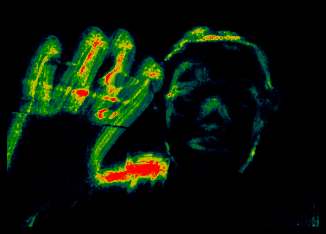

Hunter Vision
===============

Hunter Vision uses the HTML5 getUserMedia API and WebGL to transform a video stream from your webcam into a real-time movement-triggered heatmap representation. 

**[See it in action](https://hunter-vision.vercel.app/)**.

If your browser is not supported you can watch a [demo video](http://www.youtube.com/watch?v=a_4ZhcT9hSs).

## Supported browsers

* Chrome &ge; 21
* Firefox &ge; 17 (requires `media.navigator.enabled = true` in `about:config`)
* Opera &ge; 12

## Libraries used

* Camera input is done using the [camera.js library](https://github.com/radhesh1/camera.js).
* The heatmap is produced using the [WebGL heatmap library](https://github.com/pyalot/webgl-heatmap), created by [Florian Bösch](https://github.com/pyalot).
* The movement detection code is adapted and optimized from the [magic xylophone](http://www.adobe.com/devnet/html5/articles/javascript-motion-detection.html).

## Author

**Radhesh Goel**

* [About me](https://portfolio-radhesh1.vercel.app/)
* LinkedIn: [linkedin.com/in/idevelop](http://www.linkedin.com/in/radhesh-g)
* Twitter: [@Radhesh_Goel](https://twitter.com/Radhesh_Goel)

## License

- This code is licensed under the MIT License.
- The [WebGL heatmap library](https://github.com/pyalot/webgl-heatmap/) is licensed under the MIT License.
